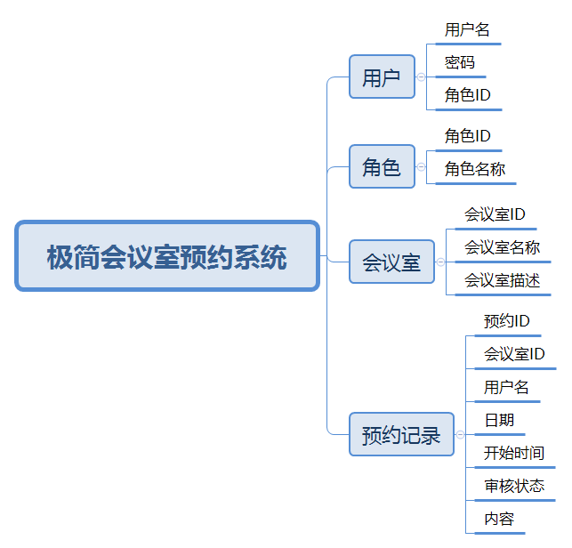
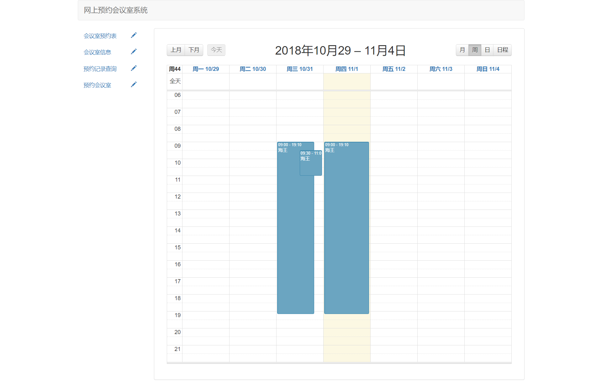

# 极简会议室预约系统
### 系统功能

基础功能
> 1、登录
> 2、注册
> 3、退出

游客：
> 1、查看会议室预约情况——日程表形式
> 2、查看会议室预约情况——列表形式
> 3、查看会议室列表信息

员工：
> 1、查看会议室预约情况——日程表形式
> 2、查看会议室列表信息
> 3、预约会议室
> 4、取消预约

管理员：
> 1、会议室信息管理
> 2、会议室预约审核管理
> 3、代用户注册
> 4、查看会议室预约情况——日程表形式

### 系统数据表示意

### 系统截图

1、游客

2、员工

3、管理员

### 系统运行
1、创建conference_room数据库，导入sql
2、修改数据库链接设置
3、本项目采用maven管理项目，如果项目运行报Spring错，请检查自己maven导入jar中是否有个Maven:org.springframework: spring-2.5.6.SEC03.jar，如果有，删之。

### [更新记录](UPDATE.md)
