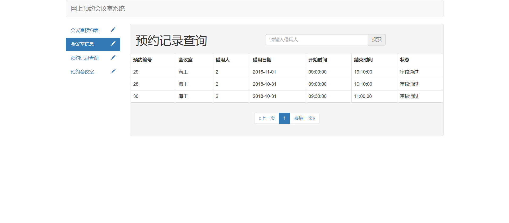
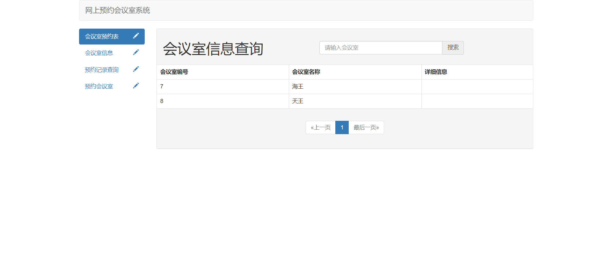
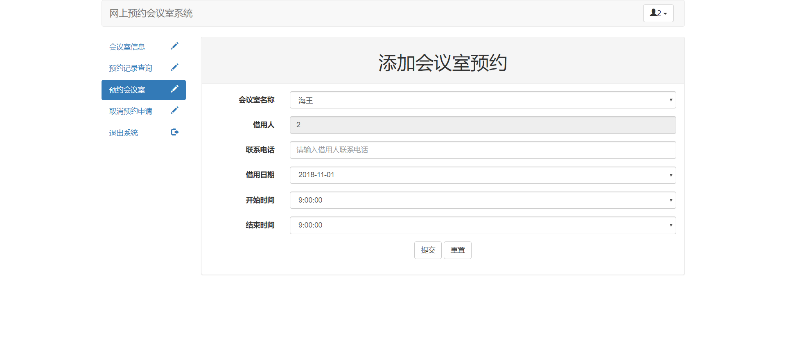
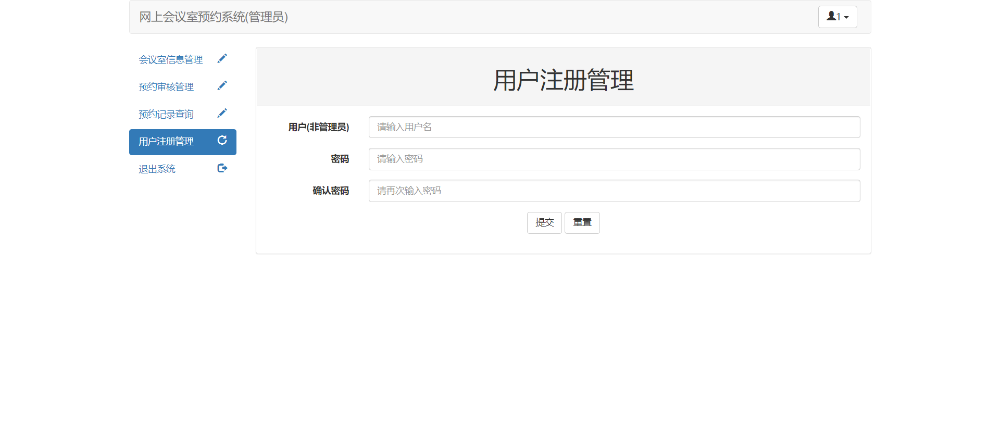
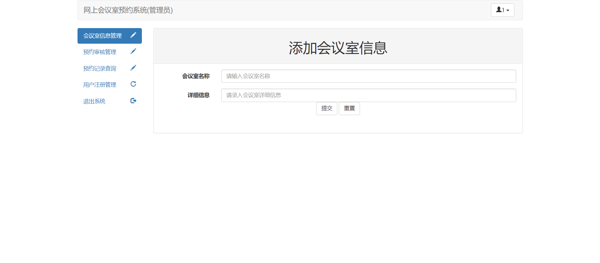
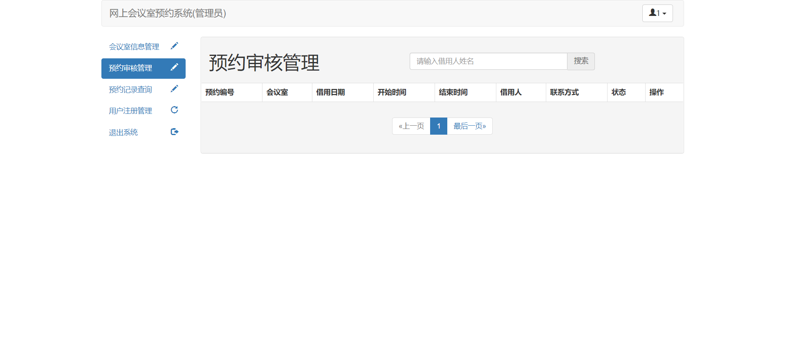

# 极简会议室预约系统

***

### 系统功能

基础功能
> * 登录
> * 注册
> * 退出

游客：
> * 查看会议室预约情况——日程表形式
> * 查看会议室预约情况——列表形式
> * 查看会议室列表信息

员工：
> * 查看会议室预约情况——日程表形式
> * 查看会议室列表信息
> * 预约会议室
> * 取消预约

管理员：
> * 会议室信息管理
> * 会议室预约审核管理
> * 代用户注册
> * 查看会议室预约情况——日程表形式

### 系统数据表示意

### 系统截图

1、游客

2、员工

3、管理员

### 系统运行
> * 创建conference_room数据库，导入sql
> * 修改数据库连接设置
> * 本项目采用maven管理项目，如果项目运行报Spring错，请检查自己maven导入jar中是否有个Maven:org.springframework: spring-2.5.6.SEC03.jar，如果有，删之。

### [更新记录](UPDATE.md)
